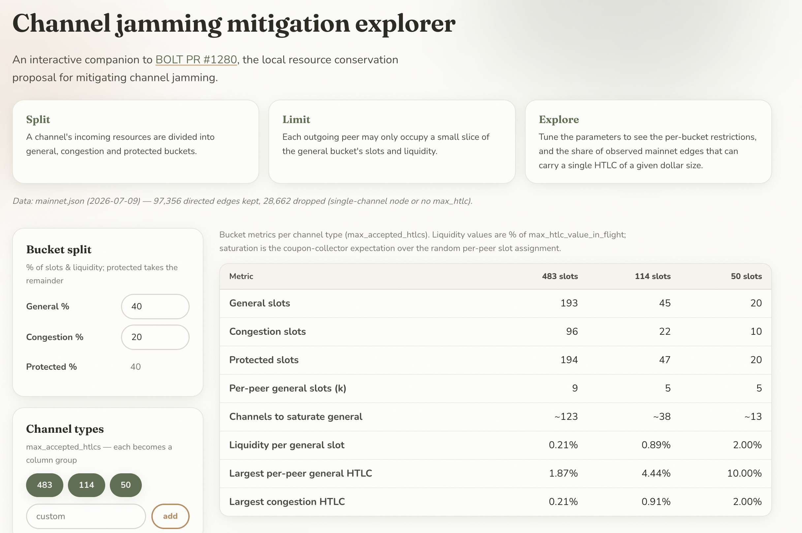
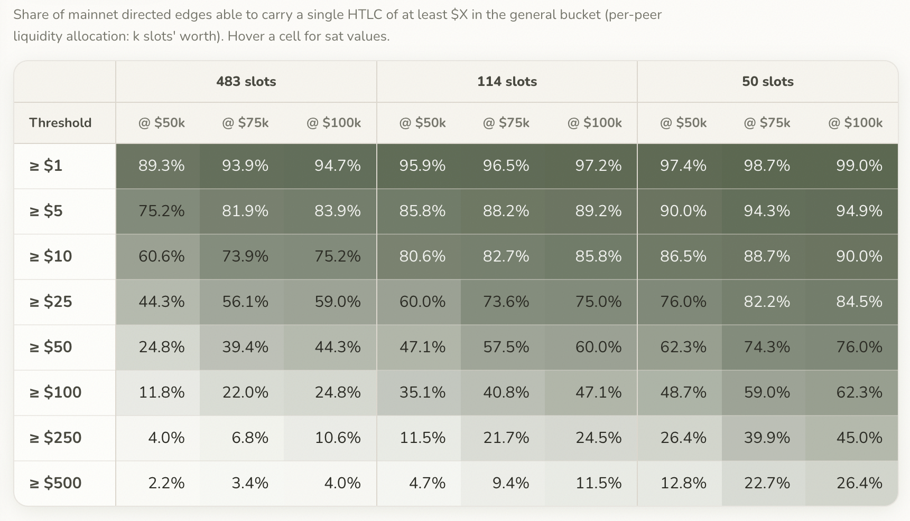

# Channel Jamming Mitigation Explorer

Interactive explorer for the resource-bucket parameters proposed in
[BOLT PR #1280](https://github.com/lightning/bolts/pull/1280) (local resource
conservation), evaluated against the observed mainnet graph.

## Run it

Open `index.html` in a browser — no build step, no server needed.
(`python3 -m http.server` works too if you prefer a URL.)

## What it shows

- **Per-channel-type metrics** for each `max_accepted_htlcs` you select:
  slots per bucket (general / congestion / protected), per-peer general slot
  allocation `k = max(min_slots, ⌊general_slots × pct⌋)`, the expected number
  of channels an attacker needs to saturate the general bucket (coupon
  collector over the random slot assignment), and liquidity limits as a
  percentage of `max_htlc_value_in_flight_msat`.
- **Distribution table**: share of mainnet directed edges able to carry a
  single HTLC of at least $X in the general bucket (per-peer liquidity
  allocation) or the congestion bucket (one slot's liquidity), across the BTC
  prices you configure. Hover a cell for sat values.

The base value per edge is the direction's advertised `max_htlc_msat` — the
observable lower bound on `max_htlc_value_in_flight_msat`. Directed policies
are kept only when the advertising node has more than one channel
(single-channel nodes are assumed to be non-forwarding).

## Screenshots

The parameters panel and per-channel-type metrics table:



The distribution table — share of mainnet edges able to carry a single HTLC of
at least $X across BTC prices and channel types:



## Reproduce the numbers on the command line

`analyze_buckets.py` is the headless twin of the page: it runs the same bucket
math over the same filtered graph and prints the two tables you see in the
browser — the per-channel-type metrics and the distribution table. Point it at
a `describegraph` dump:

```
python3 analyze_buckets.py mainnet.json
```

All the page's controls are flags (`--general-pct`, `--congestion-pct`,
`--channel-types`, `--min-slots`, `--alloc-pct`, `--prices`, `--thresholds`);
`--csv PATH` dumps every cell for further plotting. Defaults match the page, so
a bare run reproduces the example screenshots above.

## Regenerate the data

`data.js` is committed so the page works from a clone. To rebuild it from a
fresh `lncli describegraph` dump:

```
python3 build_data.py mainnet.json --output data.js
```

## Tests

```
node math.test.js                    # pure bucket math (browser)
python3 build_data.py --self-test    # graph filtering / histogram
python3 analyze_buckets.py --self-test   # command-line bucket math
```
