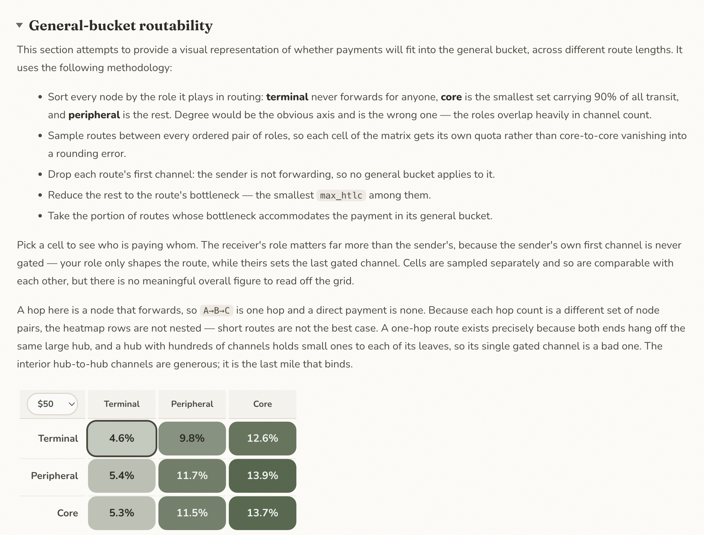

# Channel Jamming Mitigation Explorer

Interactive explorer for the resource-bucket parameters proposed in
[BOLT PR #1280](https://github.com/lightning/bolts/pull/1280) (local resource
conservation), evaluated against the observed mainnet graph.

**Live page: <https://carlakc.github.io/jamming-capacity/>**

## Run it

Try it in your browser at <https://carlakc.github.io/jamming-capacity/>, or run
it locally: open `index.html` — no build step, no server needed.
(`python3 -m http.server` works too if you prefer a URL.)

## What it shows

The page has a **Parameters** row across the top and three result sections
below it — **Channel statistics**, **Channel distribution** and **Channel
percentiles** — each collapsible by its heading.

- **Channel statistics**, per `max_accepted_htlcs`: slots per bucket
  (general / congestion / protected), per-peer general slot allocation
  `k = max(min_slots, ⌊general_slots × pct⌋)`, the expected number of channels
  an attacker needs to saturate the general bucket (coupon collector over the
  random slot assignment), and liquidity limits as a percentage of
  `max_htlc_value_in_flight_msat`.

The channel types (483 / 114 / 50) and BTC prices ($50k / $75k / $100k) are
fixed on the page; `analyze_buckets.py` takes `--channel-types` and `--prices`
to vary them.

**Liquidity** is always split by percentage of `max_htlc_value_in_flight_msat`
— general and congestion, with protected taking the remainder.

**Slots** can be split either way, via the toggle beside the "Bucket slots"
heading:

- **`%`** (default) — a percentage of `max_accepted_htlcs`, so each bucket
  scales with the channel. 40/20 gives the 193/96/194, 45/22/47 and 20/10/20
  splits from the proposal.
- **`fixed`** — hard-set counts that don't scale, 30 and 10 by default.
  Protected takes whatever is left, so only it varies by channel type.

Protected is derived in both modes and never editable. Fixed counts that
wouldn't fit inside a selected channel type are refused rather than clamped:
picking 30 + 10 with a 20-slot type in play raises an error on the page and
exits non-zero on the command line.
- **Channel distribution**: share of mainnet directed edges able to carry a
  single HTLC of at least $X in the general bucket (per-peer liquidity
  allocation) or the congestion bucket (one slot's liquidity), across the three
  BTC prices. Hover a cell for sat values. The dollar thresholds are
  the rows, and are edited in place: `+` on the last row adds one (the table
  re-sorts around it), and hovering a row reveals a `×` to drop it.
- **Channel percentiles**: the inverse question — what the edge at a
  given `max_htlc` percentile can actually forward, in dollars, through one
  general slot, a peer's whole general allocation (k slots), or a congestion
  slot. The corner cell picks the BTC price and the channel type; hover a cell
  for sat values.
- **General-bucket routability**: what share of routes keeps moving through the
  general bucket with no reputation, against payment size. Measured over real
  routes sampled from the graph, not composed from a per-hop probability. A
  heatmap sweeps one to six hops. Set the payment size by typing it or by
  dragging across either the chart or the heatmap; the shaded band marks the
  $10–$200 range where everyday payments sit.

At the defaults, a $50 payment at $75k/BTC clears a one-hop route 5.5% of the
time and a three-hop route 4.3%.

The base value per edge is the direction's advertised `max_htlc_msat` — the
observable lower bound on `max_htlc_value_in_flight_msat`. Where a direction
advertises none (about a fifth of them), 99% of channel capacity stands in: the
median advertising direction sets exactly that, and dropping them would compound
along a route and bias the sample towards paths of well-configured nodes.
Directed policies enter the histogram only when the advertising node has more
than one channel (single-channel nodes are assumed to be non-forwarding), though
such nodes are still sampled as route endpoints.

### How routes are sampled

`build_data.py` walks the real graph, and the page reads the result:

- Endpoints are drawn uniformly from **edge nodes** — those with five channels
  or fewer (`--endpoint-max-degree`), which is 13,309 of the graph's nodes.
  Payments start and finish at wallets, not at the routing hubs in the middle;
  hubs stay in the graph and carry the traffic, they are just never addressed.
  This reproduces the spoke → hub → … → hub → spoke shape without asserting it.
- Each pair is routed by shortest hop count, cheapest among equals. Scoring on
  fee alone chases zero-fee channels through five- and six-hop paths, which is
  not what a sender picks.
- A **hop** is a node that forwards. `A→B→C` is one hop; a direct payment is
  none.
- The route's first channel is dropped — the sender is not forwarding, so no
  general bucket applies to it. This matters: the sender's own channel is the
  single binding constraint on about 44% of routes, and it is systematically
  the smallest one on the path.
- What remains is reduced to the route's **bottleneck**, the smallest
  `max_htlc` among the gated channels.

Because the general allocation is the same fraction `f` of every channel's
`max_htlc`, a route clears a payment `p` exactly when `bottleneck ≥ p / f`. The
bottleneck therefore depends only on the topology, so every bucket parameter on
the page stays live against a frozen route sample.

Hop counts are different populations of node pairs, so the rows are not nested,
and short routes are not the best case. A one-hop route exists precisely because
both endpoints hang off the *same* hub — median degree 812 — and a hub with
hundreds of channels holds small ones to each of its leaves:

| | delivery-hop median | clears $50 | destination degree | last forwarder degree |
|---|---|---|---|---|
| 1 hop | 59,400 sat | 5.5% | 1 | 812 |
| 2 hops | 675,000 sat | 18.5% | 2 | 663 |
| 3 hops | 297,000 sat | 11.8% | 1 | 558 |

The interior hub-to-hub channels are generous (5.9M sat median at two hops); it
is the last mile into the destination that binds. This is why the one-hop and
three-hop curves cross rather than nesting.

## Screenshots

The parameters row and the channel statistics table:


The distribution table — share of mainnet edges able to carry a single HTLC of
at least $X across BTC prices and channel types:


The channel percentile table — what each bucket lets the edge at a given
`max_htlc` percentile forward:


The routability visualizer — the share of sampled routes still clearing the
general bucket without reputation:



## Reproduce the numbers on the command line

`analyze_buckets.py` is the headless twin of the page: it runs the same bucket
math over the same filtered graph and prints the three tables you see in the
browser — the per-channel-type metrics, the distribution table and the channel
percentiles. Point it at a `describegraph` dump:

```
python3 analyze_buckets.py mainnet.json
```

All the page's controls are flags (`--general-pct`, `--congestion-pct`,
`--slot-mode`, `--general-slot-pct`, `--congestion-slot-pct`,
`--general-slots`, `--congestion-slots`, `--channel-types`, `--min-slots`,
`--alloc-pct`, `--prices`, `--thresholds`, `--percentiles`,
`--percentile-price`, `--percentile-type`, `--payments`, `--route-sources`,
`--route-per-source`, `--route-seed`, `--endpoint-max-degree`);
`--csv PATH` dumps every cell for further plotting. Defaults match the page, so
a bare run reproduces the example screenshots above. It re-samples routes from
the graph rather than reading `data.js`, so with the default seed it reproduces
the page's routability figures exactly.

## Regenerate the data

`data.js` is committed so the page works from a clone. To rebuild it from a
fresh `lncli describegraph` dump:

```
python3 build_data.py mainnet.json --output data.js
```

This also re-samples the routes behind the routability section
(`--sources`, `--per-source`, `--route-seed`, `--endpoint-max-degree`), which
takes about 25 seconds. Pass `--endpoint-max-degree 0` to lift the endpoint
restriction and let hubs send and receive as well.

## Tests

```
node math.test.js                    # pure bucket math (browser)
python3 build_data.py --self-test    # graph filtering, imputation, route sampling
python3 analyze_buckets.py --self-test   # command-line bucket math
```
