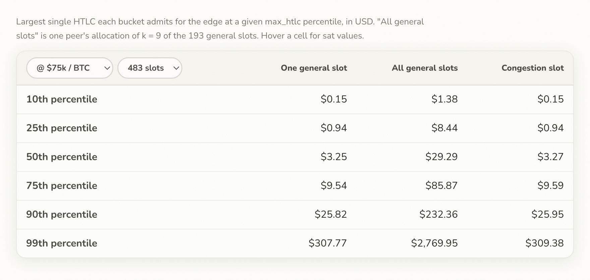

# Channel Jamming Mitigation Explorer

Interactive explorer for the resource-bucket parameters proposed in
[BOLT PR #1280](https://github.com/lightning/bolts/pull/1280) (local resource
conservation), evaluated against the observed mainnet graph.

**Live page: <https://carlakc.github.io/jamming-capacity/>**

## Run it

Try it in your browser at <https://carlakc.github.io/jamming-capacity/>, or run
it locally: open `index.html` — no build step, no server needed.
(`python3 -m http.server` works too if you prefer a URL.)

## What it shows

- **Per-channel-type metrics** for each `max_accepted_htlcs` you select:
  slots per bucket (general / congestion / protected), per-peer general slot
  allocation `k = max(min_slots, ⌊general_slots × pct⌋)`, the expected number
  of channels an attacker needs to saturate the general bucket (coupon
  collector over the random slot assignment), and liquidity limits as a
  percentage of `max_htlc_value_in_flight_msat`.

**Liquidity** is always split by percentage of `max_htlc_value_in_flight_msat`
— general and congestion, with protected taking the remainder.

**Slots** can be split either way, via the toggle beside the "Bucket slots"
heading:

- **`%`** (default) — a percentage of `max_accepted_htlcs`, so each bucket
  scales with the channel. 40/20 gives the 193/96/194, 45/22/47 and 20/10/20
  splits from the proposal.
- **`fixed`** — hard-set counts that don't scale, 30 and 10 by default.
  Protected takes whatever is left, so only it varies by channel type.

Protected is derived in both modes and never editable. Fixed counts that
wouldn't fit inside a selected channel type are refused rather than clamped:
picking 30 + 10 with a 20-slot type in play raises an error on the page and
exits non-zero on the command line.
- **Distribution table**: share of mainnet directed edges able to carry a
  single HTLC of at least $X in the general bucket (per-peer liquidity
  allocation) or the congestion bucket (one slot's liquidity), across the BTC
  prices you configure. Hover a cell for sat values. The dollar thresholds are
  the rows, and are edited in place: `+` on the last row adds one (the table
  re-sorts around it), and hovering a row reveals a `×` to drop it.
- **Channel percentile table**: the inverse question — what the edge at a
  given `max_htlc` percentile can actually forward, in dollars, through one
  general slot, a peer's whole general allocation (k slots), or a congestion
  slot. The corner cell picks the BTC price and the channel type; hover a cell
  for sat values.

The base value per edge is the direction's advertised `max_htlc_msat` — the
observable lower bound on `max_htlc_value_in_flight_msat`. Directed policies
are kept only when the advertising node has more than one channel
(single-channel nodes are assumed to be non-forwarding).

## Screenshots

The parameters row and the channel statistics table:


The distribution table — share of mainnet edges able to carry a single HTLC of
at least $X across BTC prices and channel types:


The channel percentile table — what each bucket lets the edge at a given
`max_htlc` percentile forward:



## Reproduce the numbers on the command line

`analyze_buckets.py` is the headless twin of the page: it runs the same bucket
math over the same filtered graph and prints the three tables you see in the
browser — the per-channel-type metrics, the distribution table and the channel
percentiles. Point it at a `describegraph` dump:

```
python3 analyze_buckets.py mainnet.json
```

All the page's controls are flags (`--general-pct`, `--congestion-pct`,
`--slot-mode`, `--general-slot-pct`, `--congestion-slot-pct`,
`--general-slots`, `--congestion-slots`, `--channel-types`, `--min-slots`,
`--alloc-pct`, `--prices`, `--thresholds`, `--percentiles`,
`--percentile-price`, `--percentile-type`);
`--csv PATH` dumps every cell for further plotting. Defaults match the page, so
a bare run reproduces the example screenshots above.

## Regenerate the data

`data.js` is committed so the page works from a clone. To rebuild it from a
fresh `lncli describegraph` dump:

```
python3 build_data.py mainnet.json --output data.js
```

## Tests

```
node math.test.js                    # pure bucket math (browser)
python3 build_data.py --self-test    # graph filtering / histogram
python3 analyze_buckets.py --self-test   # command-line bucket math
```
