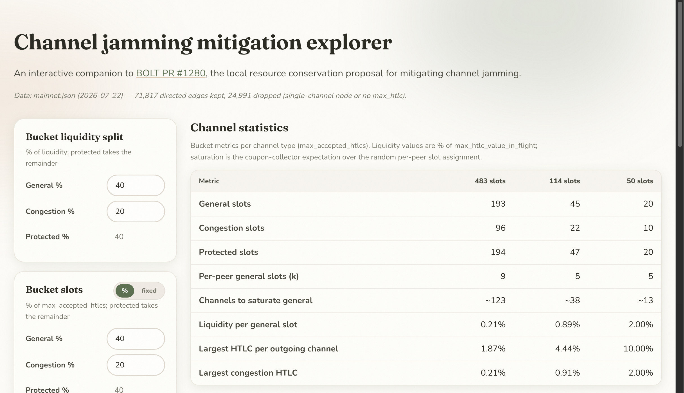
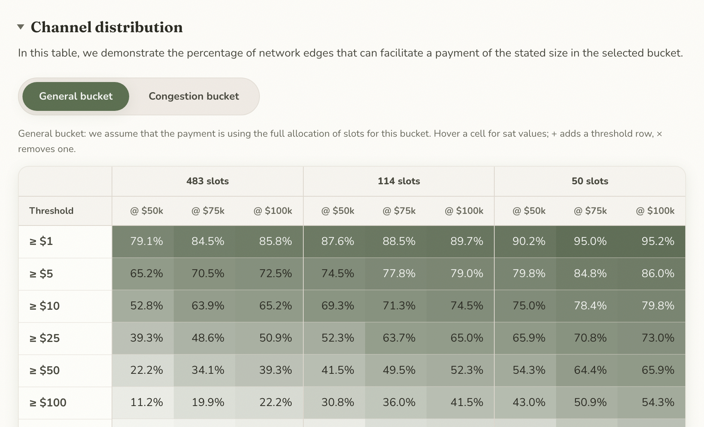

# Channel Jamming Mitigation Explorer

Interactive explorer for the resource-bucket parameters proposed in
[BOLT PR #1280](https://github.com/lightning/bolts/pull/1280) (local resource
conservation), evaluated against the observed mainnet graph.

**Live page: <https://carlakc.github.io/jamming-capacity/>**

## Run it

Try it in your browser at <https://carlakc.github.io/jamming-capacity/>, or run
it locally: open `index.html` — no build step, no server needed.
(`python3 -m http.server` works too if you prefer a URL.)

## What it shows

The page has a **Parameters** row across the top, a **Filtering** section under
it, and three result sections below that — **Channel statistics**, **Channel
distribution** and **Channel percentiles** — each collapsible by its heading.

- **Channel statistics**, per `max_accepted_htlcs`: slots per bucket
  (general / congestion / protected), per-peer general slot allocation
  `k = max(min_slots, ⌊general_slots × pct⌋)`, the expected number of channels
  an attacker needs to saturate the general bucket (coupon collector over the
  random slot assignment), and liquidity limits as a percentage of
  `max_htlc_value_in_flight_msat`.

The channel types (483 / 114 / 50) and BTC prices ($50k / $75k / $100k) are
fixed on the page; `analyze_buckets.py` takes `--channel-types` and `--prices`
to vary them.

**Liquidity** is always split by percentage of `max_htlc_value_in_flight_msat`
— general and congestion, with protected taking the remainder.

**Slots** can be split either way, via the toggle beside the "Bucket slots"
heading:

- **`fixed`** (default) — hard-set counts that don't scale, 30 and 10 by
  default. Protected takes whatever is left, so only it varies by channel type.
- **`%`** — a percentage of `max_accepted_htlcs`, so each bucket scales with
  the channel. 40/20 gives the 193/96/194, 45/22/47 and 20/10/20 splits from
  the proposal.

Protected is derived in both modes and never editable. Fixed counts that
wouldn't fit inside a selected channel type are refused rather than clamped:
picking 30 + 10 with a 20-slot type in play raises an error on the page and
exits non-zero on the command line.
- **Channel distribution**: share of mainnet directed edges able to carry a
  single HTLC of at least $X, across the three BTC prices. Hover a cell for sat
  values. The dollar thresholds are the rows, and are edited in place: `+` on
  the last row adds one (the table re-sorts around it), and hovering a row
  reveals a `×` to drop it. Caveats on how the figures are derived sit under
  the table.

  **What the columns are depends on the slot mode.** Fixed slot counts do not
  scale with `max_accepted_htlcs`, so every channel type yields the same
  figures — grouping by type would print one column three times. The columns
  are the three buckets instead, and all of them are readable at once: a single
  general slot, a peer's whole general allocation, and one congestion slot.
  Under percentage slots the buckets do scale with the channel, so the columns
  go back to being the channel types and a row of tabs above the table picks
  which bucket to show. `analyze_buckets.py` splits the same way: one
  by-bucket table under `--slot-mode fixed`, one table per bucket otherwise.

- **Channel percentiles**: the inverse question — what the edge at a given
  `max_htlc` percentile can forward through one general slot, two, a peer's
  whole allocation, or a congestion slot. The corner cell picks the BTC price,
  and the channel type too under percentage slots; hover a cell for sat values.

  Percentiles are taken over the **whole** graph rather than the filtered set,
  so a row means the same edge whatever the filter is doing and the rows stay
  comparable as you move it. Recomputing them over the survivors would make the
  50th percentile a different edge at every setting. Rows the filter excludes
  are greyed instead of dropped, and the boundary is exactly where the filter's
  reported share falls: dropping 20.2% of edges greys every row below the 20th
  percentile, so p10 greys and p25 stays. `analyze_buckets.py` marks the same
  rows `(filtered)`.

## Filtering

The **Filtering** section sets a floor on advertised `max_htlc`: edges below it
are excluded from further analysis, treated as absent from the graph rather than
down-weighted. Every table underneath is recomputed over the survivors, so its
percentages are shares of what is left rather than of the whole network. The
filtering matters because some channels are simply too small to forward payments
with any additional restriction placed on them.

**The default floor is 100,000 sat** — about $75 at $75,000/BTC — which is the
cutoff under consideration. A fresh page is therefore already filtered.

Beside the dropdown, the section states what the current floor removes, as both
a share of edges and a share of advertised liquidity. The two are worth reading
together: at the default floor they are 20.2% and 0.09%. A fifth of the graph's
directed edges advertise under 100,000 sat, and between them they hold about a
thousandth of its advertised liquidity — which is the case for setting them
aside.

Below the control sits a histogram of advertised `max_htlc` across all directed
edges, four bars per power of ten from 1 sat to 1 G sat. Filtered bars grey out.
Because a bar covers a range of values, a floor landing inside one cuts that bar
in two rather than colouring the whole thing by which side its edge falls on; a
rule marks the cut.

The histogram is also the control. Hovering a bar states its range, how many
edges it holds and what share of the graph that is, and — where the filter cuts
through it — how many of its edges fall each side of the cut. Dragging across
the plot moves the filter, at two significant figures rather than snapped to the
dropdown's presets; the dropdown grows an entry for whatever the drag picks, so
the two controls always agree. Dragging off the left end clears the filter.

The dropdown offers floors from 1 k to 10 M sat, the largest of which still
leaves about an eighth of the edges in view, plus "No filter". A drag can go
further, but stops at the largest advertised `max_htlc` so it can never empty
the graph and leave the tables a wall of `n/a`. On the command line the same
control is `--min-max-htlc SAT`, defaulting to 100000 to match the page.

The base value per edge is the direction's advertised `max_htlc_msat` — the
observable lower bound on `max_htlc_value_in_flight_msat`. Where a direction
advertises none (about a fifth of them), 99% of channel capacity stands in: the
median advertising direction sets exactly that, and dropping them would bias the
histogram towards well-configured nodes. Directed policies enter the histogram
only when the advertising node has more than one channel (single-channel nodes
are assumed to be non-forwarding).

## Screenshots

The parameters row and the channel statistics table:



The distribution table — share of mainnet edges able to carry a single HTLC of
at least $X across BTC prices and channel types:



## Reproduce the numbers on the command line

`analyze_buckets.py` is the headless twin of the page: it runs the same bucket
math over the same filtered graph and prints the same tables you see in the
browser — the per-channel-type metrics, the distribution table and the channel
percentiles. Point it at a `describegraph` dump:

```
python3 analyze_buckets.py mainnet.json
```

All the page's controls are flags (`--general-pct`, `--congestion-pct`,
`--slot-mode`, `--general-slot-pct`, `--congestion-slot-pct`,
`--general-slots`, `--congestion-slots`, `--channel-types`, `--min-slots`,
`--alloc-pct`, `--min-max-htlc`, `--prices`, `--thresholds`, `--percentiles`,
`--percentile-price`, `--percentile-type`);
`--csv PATH` dumps every cell for further plotting. Defaults match the page, so
a bare run reproduces the example screenshots above. It reads the graph dump
directly rather than `data.js`.

## Regenerate the data

`data.js` is committed so the page works from a clone. To rebuild it from a
fresh `lncli describegraph` dump:

```
python3 build_data.py mainnet.json --output data.js
```

## Tests

```
node math.test.js                    # pure bucket math (browser)
python3 build_data.py --self-test    # graph filtering and imputation
python3 analyze_buckets.py --self-test   # command-line bucket math
```
